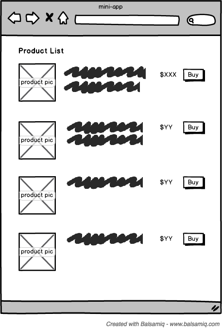
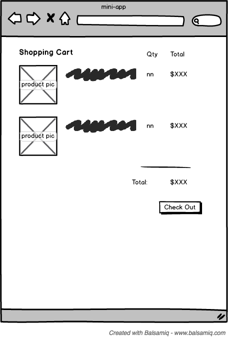
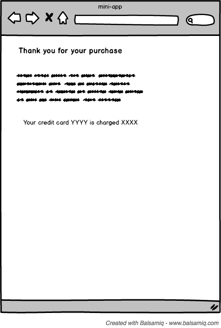

# Introduction

We like to evaluate a developer’s skill by looking at actual working software written by the candidate. We will ask you to review your software with us at a detail level during the first half of our interview.

There are 2.5 options we like to offer you to showcase your working software with us:

## Option 1: 

Bring in some sample code that you have written. That piece of code should:

- be part of an application that is in use in production somewhere
- be responsible for more than one “page” of UI, therefore include logic for transitioning between different screens
- have interaction with some external services or API
- use a modern FE framework, React.js preferred

## Option 2a:

Understandably you may not be able to show us production code from your current employer. Option 2 is to implement a mini-application that we outline below. We will then review the mini-app during the interview process. We understand that your time is valuable so we do not expect you to spend more than 4 hours of time creating this mini-app.

## Option 2b:

 If you do not have time to actually implement a working mini-app, you can choose to just whiteboard your design and technical approach during the interview.

## Mini-App for Option 2

### Requirement

- Develop a mini shopping application for a ecommerce company.
- Develop three screens
  - (1) product listing screen showing a list of product for purchase, the main user interaction is to order one or more products from this page.
  - (2) a check out screen listing the product and the corresponding quantities the user selected for purchase, and the total price the user will be paying, with a “check out” action to make the purchase
  - (3) a thank you and confirmation screen after the check out, showing some marketing message and confirmation information.
- Use React.js to implement this application
- Use some flux framework to manage data flow
- The product information is given in a json file that you should load via a HTTP get at: https://raw.githubusercontent.com/pkshiu/miniapp/master/fixtures/products.json
- Include build scripts (webpack preferred)
- You can load the actual product images supplied in this repo as well.

### Rough Screens Mockup:

## Not Required

- You should not spend more than 4 hours on this application
- We are not looking for visual design, simple looking visuals are totally ok
- Ignore user account, logged in user management, etc
- Ignore actual payment processing, the “checkout” process does not have to have any actual side effect. Just navigation to the thank you screen.

## Questions?

If you have questions, please reach out directly.

